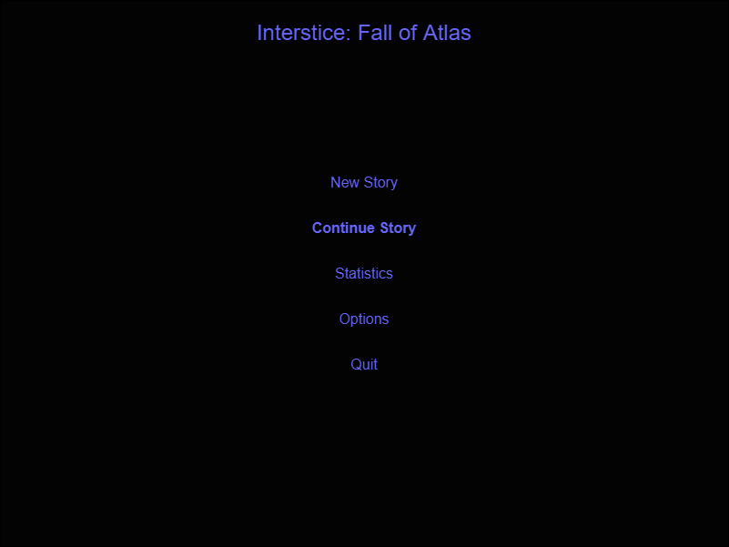
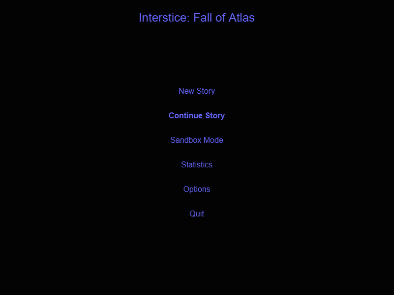

# Interstice: Fall of Atlas

"Soft" Game Architecture

Copyright (c) 2020 Dash Bang Splat Games (Travis Chase), all rights reserved.

# Game Engineering 

## Criteria

- High speed
- Low memory
- No spiking in resources
- Scalability - O(n) expected
- Believabilty
- Control
- Low cost development

# Game Structure (Description and Diagrams)

## User Interface

### Main Menu

There are three states for the main menu depending on if it is the first time the game is played (no saved data), has saved data but no game completion or has saved data and has completed the game at least once.

#### First time played (no saved data)

#### Has saved data but no game completion

#### Has saved data and has completed the game at least once 

### In Game UI

### In Game Menu Overlay

## Event Handling

### Main Menu

### In Game

## Data Engines

### Overal Game Data

### Per Stage Game Data

## In Game Dynamic Systems (collisions, physics)

## In Game Logic Engine

## Graphics Engine

## Sound Engine

## Music System

## Control Abstraction Layer (keyboard / mouse)

## Game configuration system (options)

## Help System

# Game Loop Sequences (Description and Diagrams)

## User Interface

### Main Menu

### In Game UI

### In Game Menu Overlay

## Event Handling

### Main Menu

### In Game

## Data Engines

### Overal Game Data

### Per Stage Game Data

## In Game Dynamic Systems (collisions, physics)

## In Game Logic Engine

## Graphics Engine

## Sound Engine

## Music System

## Control Abstraction Layer (keyboard / mouse)

## Game configuration system (options)

## Help System