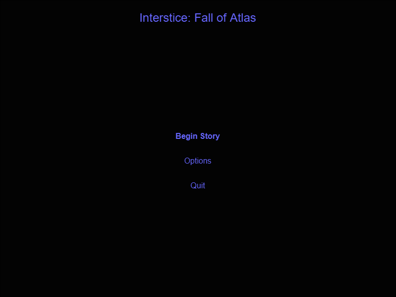
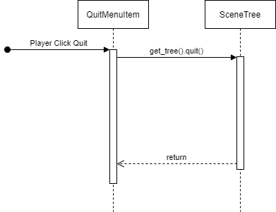

# Interstice: Fall of Atlas

Game Design and Architecture

Copyright (c) 2020 Dash Bang Splat Games (Travis Chase), all rights reserved.

# Game Engineering 

## Criteria

- High speed
- Low memory
- No spiking in resources
- Scalability - O(n) expected
- Believabilty
- Control
- Low cost development

# Game Structure

## User Interface

### Sourcing Notes

Using royalty free assets for UI and game elements from sites such as:

[opengameart.org](https://opengameart.org/)
[kenney.nl](https://kenney.nl/assets)

### Main Menu

There are three states for the main menu depending on if it is the first time the game is played (no saved data), has saved data but no game completion or has saved data and has completed the game at least once.

#### First time played (no saved data)

#### Has saved data but no game completion

#### Has saved data and has completed the game at least once 

### In Game UI

The player ship remains at the center of the camera.

In the top left is Player Energy / Shield Bar, below that is player health bar.
The Player Energy / Shield bar is expended with any attack action taken as well as with any damage taken.
Player actions cease if their is no energy left until it start to recharge.
If damage is taken with there is not shield left them health is taken. When health is reduced to zero the player loose one of their lives.
Player lives are displayed as little ship icons just below the energy and health bars.

In the top center is the current overall objective of the stage and the time remaining to complete the stage. 

In the top right there is a mini map showing information on the current screen plus a screen's work of information in every direction around the main screen as smaller details (barients, points of interest, enemies and possbily enemy projectiles)

In the bottom right is the current array of player capabilities (attacks and utility actions)

Enemies and stage elements are displayed on the screen relative to the players current position on the larger map of the stage. Thus they may be off screen at various times.

The City stage and challenges have slightly deviated interfaces because in the city stage there is no direct objective or time limit. Also player actions are limited to harmless utility actions.

### In Game Menu Overlay

There is an in game menu that is available for display as well as an overlay. Allowing for in game menu optons such as *Resume*, *Options*, *Statistics* and *Quit*

## Event Handling

### Godot Notes

Godot itself has two kinds of events. InputEvents, [link](https://docs.godotengine.org/en/stable/tutorials/inputs/inputevent.html#inputevent), used for peripheral device based interactions. And Signals, [link](https://docs.godotengine.org/en/latest/getting_started/scripting/gdscript/gdscript_basics.html#signals), used for objects (Nodes) in godot to raise and respond to custom events. 

### Custom Events 

#### Object Model Considerations 

Custom Game Events are managed with a centralized EventHub that uses a pub/sub style of event handling. EventTopics are represented and emit events that can be listened to by anything else.

#### Godot Notes

Doing pub/sub in Godot with Customer Signals [link](https://docs.godotengine.org/en/stable/getting_started/step_by_step/signals.html#custom-signals) will function like the following.

A Parent Node is setup as the EventHub. Each EventTopic is a Node underneath the EventHub and can contain a number of Custome Signals that can be called to be emitted. Other Nodes use the Topics and run the emit functions to emit the signal. Those Nodes that want to listen for events of that kind would have listens in their own scripts as described in signals documentation [link](https://docs.godotengine.org/en/stable/getting_started/step_by_step/signals.html#connecting-signals-in-code)

### Main Menu

The Main Menu will support both mouse pointer and keyboard directional interactions. 

Keyboard: 

- Pressing up/down arrows or w/s keys will allow highlighting of the selected option. 
- Pressing enter on the highlighted option will perform the menu item action.

Mouse:

- Hovering over an item will highlight the option.
- Left clicking on the highlighted option will perform the menu item action.

#### Menu Item Actions

*New Story* - This will allow the player to reset the story back to the beginning state. There is not intent to allow saved game sessions at this time, except the current save, so this will overwrite existing story progress. Players will still keep all inventory obtained thus far into the new game.

*Begin Story* - This will initialize a new game taking the player into the tutorial level and beginning of the story.

*Continue Story* - This will bring the player to restore the current game. 

*Sandbox Mode* - This will bring the player to an open exploration version of the game maps.

*Options* - This will provide basic game options. For now the only intended options are changing the keyboard mapping of keys from their defaults.

*Statistics* - This will display a screen showing all statistics monitored by the game. Such as number of deaths, number of times game story has been completed, fasted time completion for each story level, number of enemies destroyed, number of time each weapon / utility were used, amount of time in each armor chassis.

*Quit* - This will end the game application.

### In Game

Press the in game menu keyboard key (default Esc) will bring up the in game menu overlay, gameplay is also paused when the in game menu is active.

#### In Game Menu Actions

*Resume* - This will hide the in game menu overlay and resume gameplay.

*Options* - This will provide the same options as available in the Main Menu options screen.

*Statistics* - This will provide the same information as available in the Main Menu options screen.

*Quit* - This will quit gameplay and return the state of the game back to the Main Menu

## Data Engines

There are two kinds of persistent game data. Overall game data and per story game data. There is also preset configuration for each stage of the game that leads to in stage only data that expires at the end of a given stage.

### Godot Notes

Data can be serialized into JSON and stored to the local filesystem, [link](https://docs.godotengine.org/en/stable/tutorials/io/saving_games.html) Files can also be encrypted, [link](https://docs.godotengine.org/en/stable/tutorials/io/encrypting_save_games.html)

### Global Game Data

This is game data persistent across stories; this includes options settings, play statistics and player inventory. Player inventory being global implies a player could gather and craft many things from the first story playthrough as well as accumulate statistics; then start a new story and continue with those statistics and inventory.

Saving this data happens at regular intervals (every minute) and at major transition points (such as changing stages) 

#### Object model considerations

There should be a GlobalGameDataManager to manage collection and saving of Global Game Data.

GlobalGameDataManager should take a GameDataFileStorage object as a constructor parameter to know what storage system to save the serialized data to.

#### Godot Notes

To keep the saving happening without blocking or slowing gameplay save functions should happen in a separate thread from gameplay, [link](https://docs.godotengine.org/en/stable/tutorials/threads/using_multiple_threads.html)

GlobalGameDataManager and GameDataFileStorage should be autoloaded in Godot project settings so every Stage has them.

### Per Story Game Data

This is game data persistent only for the current story. When a new story is chosen with an existing story in place this data is overwritten. There for an "are you sure?" dialog should be displayed to the player to confirm the overwrite.

Saving of this data happens only after significant story progressions occur, this generally happens at the successful completion of a stage or, again, if a new story is selected therefore overwriting save data.

#### Object model considerations

There should be a StoryGameDataManager to manage collection and saving of Story Game Data.

StoryGameDataManager should take a GameDataFileStorage object as a constructor parameter to know what storage system to save the serialized data to.

##### Godot Notes

StoryGameDataManager and GameDataFileStorage should be autoloaded in Godot project settings so every Stage has them.

### Per Stage Game Data

This is game data only tracked for the current stage of the game. When a stage completes this data is lost and new stage data is instanciated for the newly loaded stage. This data is not persistent, meaning no saving occurs

#### Object model considerations

Stage Game related data is generally distributed across the many objects represented in the stage and is itself not centralized as a manager like persistent data (such as Global Game data or Story Game data are)

## In Game Dynamic Systems (collisions, physics)

### Godot Notes

Godot provides 2D physics capabilties that are documented starting here: [link](https://docs.godotengine.org/en/stable/tutorials/physics/physics_introduction.html)

- Area2D - nodes will provided background environmental elements with the capability to impact motion. Example an wormhole might have a stronger gravitational pull around it for objects in motion (ships or projectiles) nearby
- StaticBody2D - nodes will provide barrier like elements such as walls or closed gateways with the capability to repel in motions objects (ships or projectiles) that collide with them.
- RigidBody2D - nodes will provide in motion objects with consistent collision results that happen in 2D space such as in motion space debry 
- KinematicBody2D - nodes will provide motion with custom interaction depending on the object it collides with this could be useful for objects such as ships or projectiles which might change interaction depending what it collides with

## In Game Logic Engine

### Godot Notes

#### Scenes

Everything in Godot is a Scene. For the purposes of this topic however we are only talking about scenes that are associated with the dispaly and represent the the current state of the main viewport of a game. We are going to call those Stages to disambiguate from the term Scene.

##### Switching Scenes

See the following document about custom scene switching [link](https://docs.godotengine.org/en/stable/getting_started/step_by_step/singletons_autoload.html?highlight=switch%20scene#custom-scene-switcher)

Note instead of just calling it Global, define it as StageManager

## Graphics Engine

Using Godots 2D graphics engine

## Sound Engine

Using Godots sound engine

### Sourcing Notes

Using royalty free sound effects from sites such as:

[freesound.org](https://freesound.org/browse/tags/space/)

## Music System

### Sourcing Notes

Using royalty free music loops / snippets initially from sites such as:

[dl-sounds.com](https://www.dl-sounds.com/royalty-free/category/game-film/video-game/)
[freemusicarchive.org](https://freemusicarchive.org/genre/Techno?sort=track_date_published&d=1&page=4)
[soundimage.org](https://soundimage.org/sci-fi/)

## Control Abstraction Layer (keyboard / mouse)

Using Godots input handling and responding to InputEvents by various UI and game elements

## Game configuration system (options)

Options will be stored in a JSON file (see data engines for additional notes)

## Help System

## Helpful Design Patterns

### State Machines

#### Godot Notes

Recommendations on how to design state machines in Godot, [link](https://docs.godotengine.org/en/stable/tutorials/misc/state_design_pattern.html)

### Object Instancing

#### Godot Nodes

Recommendations on using signal (event) based instancing of objects being created dynamically (like projectiles), [link](https://docs.godotengine.org/en/stable/tutorials/misc/instancing_with_signals.html#shooting-example)

## Unit Testing

### Godot Notes

Use GUT a Godot addon for unit testing, [link](https://github.com/bitwes/Gut)